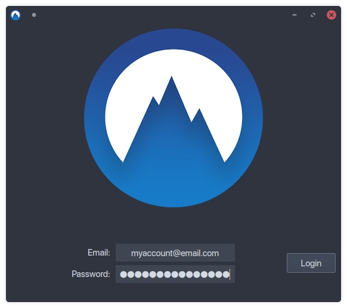
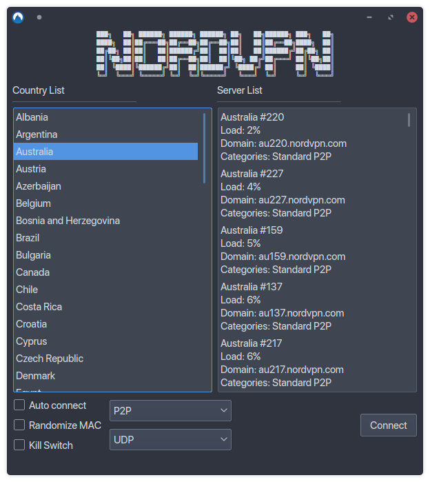

# NordVPN Network Manager GUI

#### About
NordVPN Network Manager GUI is a graphical frontend for both NordVPN and the system Network Manager.
All connections are handled directly by the network manager and user secrets are only stored in memory before being passed to the Network Manager.
Currently it operates 100% as a user process with no need for root privileges. 

This project was inspired by [NordVPN-NetworkManager](https://github.com/Chadsr/NordVPN-NetworkManager) by Chadsr. Many thanks for the code and knowledge that they published into the public domain.

#### Features
* Light - Uses the system Network Manager, application doesn't need to be running
* Clean - All configuration files are deleted after disconnection
* Secure - User secrets are passed directly from memory to the Network manager, root access is not required
* Powerful - Supports a variety of different protocols and server types with more on the way.
* Kill Switch - internet connection is disabled if VPN connection is lost
* Auto Connect - VPN is connection is established on system start
* Randomize MAC - Random MAC address is assigned before establishing connection

#### Using Installation Script
Installation script should support Debian, Fedora, and Arch Linux. It will attempt to install the one dependency this program has (networkmanager-openvpn). It will also add a menu entry pointing to the current working directory of the installation script. So make sure you place the folder where you want the install to be located.

Usage: `sudo ./install.sh`

#### Known Issues
* No support for obfuscated servers
